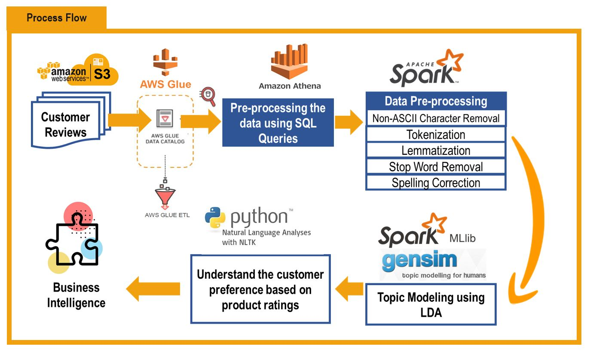

# LDA-Modeling-on-Amazon-Reviews

Why Review Mining Matters? 
- Intelligence: Reviews tell you what your audience likes and helps companies to learn more about their target demographics.
- Integrity: Amazon actively defends the integrity of its reviews by prosecuting those involved with publishing fake reviews.
- Flexibility: Apply customized filtering criteria to capture differences & trends across score ranges, product categories & locations.
- Scalability: Process vast amounts of data efficiently and with open source programs such as Python, SQL, Apache Spark & MLlib.

Process Explanation:
- We used 160 million Amazon review data spanning from 2003 to 2015 as the raw data set.
- Each review is tokenized by splitting into individual words (and bigrams). Stop words are removed and then each word is lemmatized and stemmed. Then the words are turned into spelling correction. 
- Next, we applied topic modeling using LDA to extracts key topics and themes from a large corpus of text. 
- (Latent Dirichlet Allocation (LDA) is a generative and probabilistic model that can be used to automatically group words into topics and documents into a mixture of topics.)

